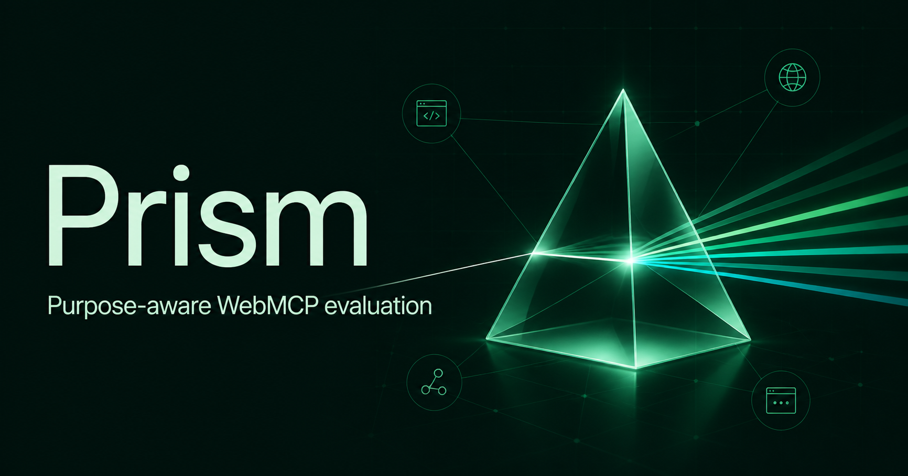

# Prism

**Purpose-aware evaluation for WebMCP.**

Prism is a WebMCP evaluation dashboard plus a local-first browser companion. Instead of rewarding any large tool surface, it scores the tools exposed in the current page state against the job the WebMCP is meant to perform.

[Open the live app](https://prism.alx21.chatgpt.site/) · [Download the browser companion](https://prism.alx21.chatgpt.site/prism-webmcp-companion.zip)



## Why Prism

A generic scanner can tell you that a page registered four tools. It cannot tell you whether those four tools cover the user's journey, whether a mutation changed the same state the person sees, or whether a consequential action still belongs to the person.

Prism starts with a declared contract:

- the product's purpose and intended user journey;
- the capabilities the agent needs;
- the mutation evidence that must survive visible read-back; and
- the action that must remain human-approved.

It then produces an interpretable score across purpose coverage, contract quality, observable proof, and runtime hygiene. Every deduction includes the underlying evidence and a repair that can be retested.

## Human and agent workflow

1. A person chooses Commerce, Project Operations, Content Editor, or defines a Custom contract.
2. The companion runs on the target page, where `document.modelContext` is actually available.
3. It discovers tools, executes only developer-selected checks, records annotations and privacy-preserving state evidence, and exports a versioned snapshot.
4. Prism maps the observed behavior to the declared journey and explains any missing coverage or proof.
5. The team repairs the tool contract and runs the same evaluation again.

The dashboard remains fully usable through its visible interface. It also exposes four page-side WebMCP tools so an agent can read the same context and update the same visible evaluation state:

- `get_evaluation_context`
- `choose_evaluation_profile`
- `run_sample_evaluation`
- `get_latest_evaluation`

## Honest execution boundary

WebMCP tools belong to the page that registered them. A hosted dashboard cannot discover or execute another origin's tools through an iframe or HTTP fetch. Prism therefore separates collection from evaluation rather than claiming cross-origin access it does not have.

The Manifest V3 companion requests only `activeTab` and `scripting`. It does not run persistently on every site. Mutating calls require a fresh one-call confirmation, and exported snapshots omit page text and tool output. They retain hashes, lengths, timing, schemas, annotations, inputs, and pass/fail evidence.

See [`extension/README.md`](extension/README.md) and [`extension/PRIVACY.md`](extension/PRIVACY.md) for the complete installation, safety, and data-handling model.

## Repository map

- `app/` and `lib/`: the purpose-aware evaluation interface and scoring engine.
- `components/webmcp-provider.tsx`: Prism's own page-side WebMCP tools.
- `extension/`: the open-source browser companion.
- `extension/test/`: deterministic snapshot and safety tests.

## Run locally

Prerequisites: Node.js 22.13 or later and pnpm.

```sh
pnpm install
pnpm dev
```

Then open the printed local URL. Run the release checks with:

```sh
pnpm test
pnpm lint
pnpm build
```

## Judge quick test

1. Open [the deployed app](https://prism.alx21.chatgpt.site/) in ChatGPT's in-app browser.
2. Confirm that four Prism WebMCP tools are available.
3. Call `get_evaluation_context` with `{}`.
4. Call `choose_evaluation_profile` with `{ "profile": "operations" }` and verify that the visible profile, intent, target label, capability map, and scorecard change.
5. Call `run_sample_evaluation` with `{ "profile": "operations" }`.
6. Call `get_latest_evaluation` with `{}` and compare its score, journey, and findings with the visible report.
7. For target-page evaluation, install the downloadable companion, collect a snapshot on a WebMCP-enabled page, and import it into Prism through the Runner snapshot control.

## License

MIT. See [`LICENSE`](LICENSE).

